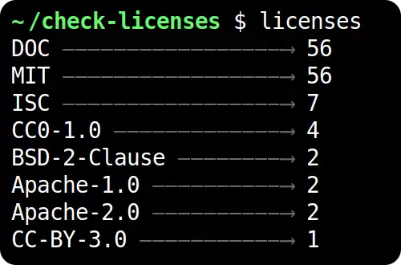

# Check Licenses

A simple tool to check all the licenses in your dependencies:



- Find all dependencies and their sub-dependencies in your project
- Validate both the `package.json` and the `LICENSE` file per dependency
- Only reads `dependencies` and not `devDependencies`
- Uses `package-lock.json` for deterministic resolution
- Handles multiple versions of the same library just fine

## Getting started

You can either use `npx check-licenses`, or install this library globally and then run it at once:

```bash
npm i check-licenses -g
licenses   # Note how this is just `licenses`
licenses --list
licenses --help

# OR

npx check-licenses
npx check-licenses --list
npx check-licenses --help
```

The main command will trigger a license summary:

```bash
$ licenses
DOC —————————————————⟶ 56
MIT —————————————————⟶ 56
ISC —————————————————⟶ 7
CC0-1.0 —————————————⟶ 4
BSD-2-Clause ————————⟶ 2
Apache-1.0 ——————————⟶ 2
Apache-2.0 ——————————⟶ 2
CC-BY-3.0 ———————————⟶ 1
```

The `--list` option will show all the dependencies you have with their licenses:

## Show the licenses used

The base command is to count how many licenses of each type are in use:

```bash
$ licenses
MIT —————————————————⟶ 1328
ISC —————————————————⟶ 113
CC0-1.0 —————————————⟶ 36
BSD-3-Clause ————————⟶ 36
Apache-2.0 ——————————⟶ 5
BSD-2-Clause ————————⟶ 3
Zlib ————————————————⟶ 1
CC-BY-3.0 ———————————⟶ 1
GPL-2.0 —————————————⟶ 1
```

## List all dependencies

This can be used to find out what each of our dependencies (direct and indirect) is using. It might list multiple licenses in a single package:

```bash
$ licenses --list
...
test-exclude@5.2.3 ————————————⟶ ISC
text-table@0.2.0 ——————————————⟶ MIT
textarea-caret@3.0.2 ——————————⟶ MIT
throat@4.1.0 ——————————————————⟶ MIT
through@2.3.8 —————————————————⟶ Apache-2.0 + MIT
through2@2.0.5 ————————————————⟶ MIT
thunky@1.1.0 ——————————————————⟶ MIT
timers-browserify@2.0.11 ——————⟶ MIT
...
```

This list is normally quite long, but it can be easily `grep`-ed. For example, to find all of the `Apache-2.0` licenses:

```bash
$ licenses --list | grep Apache-2.0
fb-watchman@2.0.1 —————————————⟶ Apache-2.0
forever-agent@0.6.1 ———————————⟶ Apache-2.0
formik@2.1.5 ——————————————————⟶ Apache-2.0 + MIT
harmony-reflect@1.6.1 —————————⟶ Apache-2.0 + MPL-1.1
human-signals@1.1.1 ———————————⟶ Apache-2.0
```

If there are multiple licenses in a library it's marked with a `+`. You can indeed also grep that!

```bash
$ licenses --list | grep +
...
are-we-there-yet@1.1.5 ————————⟶ ISC + MIT
atob@2.1.2 ————————————————————⟶ Apache-2.0 + MIT
detect-node@2.0.4 —————————————⟶ ISC + MIT
electron-to-chromium@1.3.534 ——⟶ ISC + MIT
formik@2.1.5 ——————————————————⟶ Apache-2.0 + MIT
fs.realpath@1.0.0 —————————————⟶ ISC + MIT
harmony-reflect@1.6.1 —————————⟶ Apache-2.0 + MPL-1.1
json-schema@0.2.3 —————————————⟶ AFLv2.1 + BSD
killable@1.0.1 ————————————————⟶ ISC + MIT
lodash-es@4.17.15 —————————————⟶ CC0-1.0 + MIT
lodash.memoize@4.1.2 ——————————⟶ CC0-1.0 + MIT
...
```

## Finding bad licenses

Let's say you run this tool and find the dependencies, of which you really don't want to follow CC-BY-3.0:

```bash
$ licenses
DOC —————————————————⟶ 56
MIT —————————————————⟶ 56
ISC —————————————————⟶ 7
CC0-1.0 —————————————⟶ 4
BSD-2-Clause ————————⟶ 2
Apache-1.0 ——————————⟶ 2
Apache-2.0 ——————————⟶ 2
CC-BY-3.0 ———————————⟶ 1
```

Then you can also use it to track down which dependencies have this license:

```bash
$ licenses --list | grep CC-BY-3.0
spdx-exceptions@2.3.0 ——————⟶ CC-BY-3.0
```

With this information you can either:

- Dig deeper: some times it might be dual-licensed
- Find out where this comes from with `npm ls`:

```bash
$ npm ls spdx-exceptions
check-licenses@0.2.0 /home/francisco/check-licenses
└─┬ meow@8.0.0
  └─┬ normalize-package-data@3.0.0
    └─┬ validate-npm-package-license@3.0.4
      └─┬ spdx-expression-parse@3.0.1
        └── spdx-exceptions@2.3.0
```
